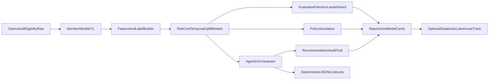

# Open Sourced Value Based Care ML Models

`Open Sourced Value Based Care ML Models` is an open-source, cloud-agnostic healthtech intelligence stack for value-based care (VBC) organizations that need clinically interpretable, contract-aware, and governance-ready machine learning over longitudinal claims data.

The platform is designed for payer and provider analytics teams operating PMPM and shared-savings contracts, with extensible workflows for member-month feature stores, multi-model risk and cost prediction, intervention prioritization, policy simulation, and agentic recommendation orchestration.

## Why this platform is differentiated

- **Contract-native analytics**: member-level predictions are linked to PMPM and shared-savings impact framing.
- **Modern model portfolio**: calibrated risk, interval cost forecasting, temporal validation, uplift proxy, and policy simulation.
- **Agentic orchestration**: specialized healthcare agents with recommendation-only guardrails, deterministic handoff contracts, and audit trails.
- **Cloud-agnostic by design**: local-first execution with optional Databricks-compatible templates for lakehouse and MLflow operations.
- **Governance-first artifacts**: model metadata sidecars, leaderboard generation, subgroup fairness slicing, and security boundaries.

## Healthcare claims ontology and glossary

- **Eligibility month**: covered member period used as denominator for PMPM analytics.
- **Claim header**: bundled treatment packages claim envelope including claim type, servicing provider, and aggregate allowed amount.
- **Claim line**: service-level granularity (CPT/HCPCS, revenue code, POS) used for utilization signatures.
- **ICD-10 diagnosis**: coded condition context used for morbidity proxies.
- **PMPM**: per member per month spend benchmark.
- **Attribution**: assignment of member responsibility to clinician group.
- **Risk stratification**: prospective identification of high-cost/high-need cohorts.
- **Care gap intervention**: operational outreach action (navigation, pharmacy follow-up, digital nudge).

## End-to-end architecture



## Data model and synthetic benchmark generation

### Core data assets

- `data/sample/claims_header.csv`
- `data/sample/claims_line.csv`
- `data/sample/diagnosis.csv`
- `data/sample/eligibility.csv`
- `data/sample/member_context.csv`
- `data/sample/interventions.csv`

### Synthetic design assumptions

- High-risk cohorts are injected with heavier claim intensity and cost burden.
- Temporal drift is introduced into benchmark trend factors for realistic backtesting stress.
- SDoH and dual-status proxy features provide equity/fairness analysis surfaces.
- Intervention propensity and engagement response fields support uplift and policy simulation.

Synthetic data is for benchmarking and reproducibility, not epidemiologic prevalence estimation.

## Feature and label specification

- **Feature windows**: rolling utilization and spend signatures over trailing months.
- **Lag features**: prior month allowed amount and utilization indicators.
- **Label horizon**: future allowed sum over configured months.
- **High-cost label**: quantile-based thresholding on future allowed sum for risk stratification.
- **Leakage controls**: temporal split semantics in temporal model variants and rolling feature construction.

## Model portfolio

### Risk intelligence
- Baseline calibrated high-cost risk model.
- Advanced stacked risk ensemble with uncertainty-aware triage scoring.
- Temporal risk model with time-series cross-validation.
- Risk trajectory segmentation model for cohort planning.
- Fairness-aware risk calibration variant for protected-population review.

### Cost intelligence
- Baseline cost regression.
- Quantile interval model (q10, q50, q90) for uncertainty-aware forecasting.
- Anomaly-based cost spike detector for outlier surveillance.
- Contract-sensitive ranking model for payer intervention sequencing.

### Intervention intelligence
- Uplift proxy model for outreach prioritization.
- Stronger uplift variant for treatment-response stratification.
- Contract impact projection including expected PMPM delta and shared-savings proxy.

### Policy intelligence
- Budget-constrained policy simulation for outreach allocation.
- Safety envelope with abstain and max outreach logic.
- Insurance contract scenario simulation (`optimistic`, `base`, `stress`).
- Policy constraint enforcement for shared-savings, downside caps, and risk corridor behavior.

## Real-World Insurance Use Cases

These examples show how payer analytics and value-based care operations teams can apply the current stack in real workflows.

### 1) Prospective high-cost member stratification for case management
- **Business problem**: Identify members likely to become high-cost in the next horizon before avoidable spend accelerates.
- **How this repo supports it**: High-cost risk models plus temporal validation (`models train-suite` and risk outputs).
- **Operational output**: Ranked member risk scores and model leaderboard artifacts.
- **Expected KPI impact**: Better risk capture precision, lower avoidable PMPM growth, improved care manager targeting yield.

### 2) Outreach queue optimization under fixed nurse capacity
- **Business problem**: Care teams cannot contact every flagged member each month.
- **How this repo supports it**: Policy simulation and recommendation guardrails (`policy simulate`, agent max outreach logic).
- **Operational output**: Capacity-constrained intervention list with abstain paths for overflow.
- **Expected KPI impact**: Higher interventions per FTE and stronger budget adherence.

### 3) Intervention prioritization using uplift-style targeting
- **Business problem**: Not all high-risk members respond equally to outreach.
- **How this repo supports it**: Uplift proxy model and `careGapAgent` eligibility gating.
- **Operational output**: Action-specific recommendations (`care_navigation_call`, `pharmacy_followup`, `digital_nudge`, abstain).
- **Expected KPI impact**: Higher intervention precision and improved ROI of care-management spend.

### 4) PMPM trend surveillance and contract early warning
- **Business problem**: Payers need early signal when PMPM trend drifts above target in shared-risk contracts.
- **How this repo supports it**: Benchmarks + summary reporting + contract impact agent outputs.
- **Operational output**: PMPM and trend outputs with expected contract delta projections.
- **Expected KPI impact**: Faster variance mitigation and improved forecastability of year-end performance.

### 5) Shared-savings and downside-risk forecasting
- **Business problem**: Finance and actuarial teams need scenario-level visibility into savings likelihood.
- **How this repo supports it**: Contract scoring, cost forecasts, and policy simulation outputs.
- **Operational output**: Expected PMPM delta and shared-savings impact proxies by recommended action cohort.
- **Expected KPI impact**: Better reserve planning and improved contracting strategy decisions.

### 6) Fairness-aware triage for vulnerable populations
- **Business problem**: Risk models can under-serve vulnerable groups without explicit equity checks.
- **How this repo supports it**: Subgroup fairness slicing and vulnerable-member protection rules in orchestration.
- **Operational output**: Slice-level evaluation plus adjusted recommendation behavior for protected cohorts.
- **Expected KPI impact**: Reduced fairness deltas and stronger compliance posture.

### 7) Data quality gating before model-driven operations
- **Business problem**: Bad upstream data can produce unstable intervention queues.
- **How this repo supports it**: `dataQualityAgent` drift/missingness/schema anomaly checks.
- **Operational output**: Quality alerts and auditable gate status before recommendations are consumed.
- **Expected KPI impact**: Fewer operational misfires caused by data defects.

### 8) Utilization management signal enrichment
- **Business problem**: UM teams need member-level risk context to prioritize outreach or review workflows.
- **How this repo supports it**: Risk + cost + temporal model stack and member-month feature lineage.
- **Operational output**: Structured risk and expected cost signals aligned to member-month records.
- **Expected KPI impact**: Earlier high-risk intervention opportunity and better alignment between UM and care management.

### 9) Pharmacy and chronic condition follow-up planning
- **Business problem**: Medication adherence and chronic burden patterns need proactive outreach stratification.
- **How this repo supports it**: Synthetic member context fields, intervention history, and `careGapAgent` action mapping.
- **Operational output**: Follow-up queues for pharmacy and care-navigation actions with rationale traces.
- **Expected KPI impact**: Better chronic population engagement and reduced acute utilization leakage.

### 10) Audit-ready recommendation governance for payer operations
- **Business problem**: Clinical operations and compliance teams need traceability for each recommendation.
- **How this repo supports it**: Deterministic JSON contracts, recommendation-only mode, and `why`/`why_not` audit logs.
- **Operational output**: Reproducible handoff artifacts and audit CSV outputs for governance review.
- **Expected KPI impact**: Improved model governance readiness and lower operational risk.

### 11) Contract-specific cohort strategy design
- **Business problem**: Different payer contracts require different intervention thresholds and action mixes.
- **How this repo supports it**: Configurable thresholds and scoring workflows with contract-aware reporting context.
- **Operational output**: Cohort-specific recommendation sets and benchmark comparisons per contract frame.
- **Expected KPI impact**: Better contract-level strategy fit and stronger medical cost containment.

### 12) Human-in-the-loop decision support for care operations
- **Business problem**: Teams need AI support without autonomous clinical action.
- **How this repo supports it**: Recommendation-only guardrails, abstain behavior, and optional deterministic LLM post-processing.
- **Operational output**: Decision-support recommendations for coordinator review, not autonomous execution.
- **Expected KPI impact**: Faster operational triage while preserving clinical governance controls.

### Use Case to Artifact Map

- High-cost stratification -> `reports/leaderboard.csv`, model artifact metadata JSON
- Outreach prioritization -> `reports/agent_recommendations.csv`
- Audit and compliance review -> `reports/agent_audit.csv`, `reports/agent_handoff_contract.json`
- Policy scenario planning -> `reports/policy_scenarios.json`
- Contract-constrained recommendation output -> `reports/recommendations_policy_enforced.csv`

## Agentic decision orchestration

### Specialized healthcare agents

- `riskTriageAgent`: risk + uncertainty + fairness-aware triage priority.
- `careGapAgent`: intervention recommendation with uplift and eligibility gates.
- `contractImpactAgent`: PMPM and shared-savings impact projection.
- `dataQualityAgent`: drift, missingness, and schema anomaly checks.

### Stage narrative (operational flow)

1. `dataQualityAgent` checks schema and missingness before decisions.
2. `riskTriageAgent` creates risk-priority cohorts with uncertainty weighting.
3. `careGapAgent` proposes intervention classes with eligibility and uplift constraints.
4. `contractImpactAgent` estimates PMPM and shared-savings deltas.
5. Guardrails enforce recommendation-only behavior and abstain paths.
6. Deterministic contracts and audit traces are emitted for governance review.

### Safety guardrails

- Recommendation-only mode enabled by default.
- No autonomous clinical action pathways.
- Low-confidence abstain behavior.
- Outreach cap enforcement.
- Vulnerable member protection rules.

### Memory, contracts, and auditability

- Shared context store for quality metrics and guardrail state.
- Deterministic JSON handoff contracts between orchestration stages.
- Audit logs with `why` and `why_not` rationale fields per recommendation.

## Evaluation and governance

- Ranking metrics: ROC-AUC, average precision.
- Cost proxy metrics: MAE-aligned utility checks.
- Fairness slices: age bands, sex proxy, dual-status proxy.
- Artifact outputs:
  - leaderboard CSV
  - model card JSON
  - agent audit CSV
  - policy simulation JSON

## CLI command matrix

```bash
# Core data and feature workflows
carevalue-ml db init
carevalue-ml data generate --output data/generated
carevalue-ml data load --input-dir data/generated
carevalue-ml features build

# Modeling workflows
carevalue-ml models train
carevalue-ml models train-suite --suite maximal
carevalue-ml models evaluate reports/predictions.csv
carevalue-ml models leaderboard reports/predictions.csv --model-name risk_v2 --run-id run_2026

# Policy and agentic workflows
carevalue-ml policy simulate reports/predictions.csv --budget 100
carevalue-ml policy scenario reports/agent_recommendations.csv
carevalue-ml policy enforce reports/agent_recommendations.csv --outreach-budget 100
carevalue-ml agents run reports/predictions.csv --output-path reports/agent_recommendations.csv
carevalue-ml agents validate-contract reports/agent_handoff_contract.json
carevalue-ml agents evaluate reports/agent_recommendations.csv reports/agent_recommendations_baseline.csv --budget 100
```

### Example insurer workflows

```bash
# Flow A: Risk + cost intelligence for actuarial review
carevalue-ml models train-suite --suite maximal
carevalue-ml models leaderboard reports/predictions.csv --model-name actuarial_suite --run-id r2026q1

# Flow B: Capacity-constrained care operations
carevalue-ml agents run reports/predictions.csv --run-id r2026q1 --contract-id DEMO
carevalue-ml policy enforce reports/agent_recommendations.csv --outreach-budget 120

# Flow C: Contract scenario planning
carevalue-ml policy scenario reports/agent_recommendations.csv
carevalue-ml agents evaluate reports/agent_recommendations.csv reports/agent_recommendations_baseline.csv --budget 120
```

## Databricks-optional deployment track

The runtime remains vendor-neutral. Optional templates in `config/databricks` provide:

- bronze/silver/gold lakehouse mapping
- MLflow-compatible run tagging strategy
- agent-run lineage conventions and scalable simulation guidance

## Reproducibility and open-source operations

- Deterministic synthetic generation via seeded configs.
- Model artifacts include metadata sidecars with run ID, task, cohort, and feature hash.
- CI includes lint and test validation.
- Contribution and governance docs:
  - `CONTRIBUTING.md`
  - `MODEL_CARDS.md`
  - `ROADMAP.md`
  - `SECURITY.md`

## Clinical safety and scope boundary

- This repository supports analytics and decision support research workflows.
- It does not deliver autonomous clinical diagnosis or treatment.
- Keep human-in-the-loop review before operational intervention workflows.
- Use synthetic or de-identified data only in development/test contexts.

## License

MIT
