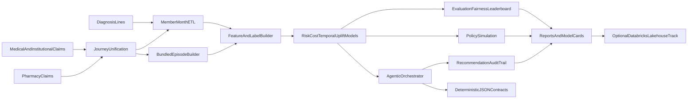

# Open Source Healthcare ML Models for Cost Reduction and Outcome Improvement

**VBC Intelligence OS** (distributed as `carevalue-claims-ml`) is an open-source machine learning platform built for healthcare organizations that need to reduce cost of care and improve patient outcomes across value-based and bundled payment contracts.

It is also a cloud-agnostic analytics stack for clinically interpretable signals derived from **longitudinal medical, institutional, and pharmacy claims**, unified into a coherent **patient journey** view for risk, cost, utilization pattern detection, and governance-ready model artifacts.

The platform targets payer actuarial and VBC operations teams, health system analytics, and care-management programs that require member-month feature stores, multi-model prediction (risk, cost, temporal behavior, uplift proxies), **episode-level financial and clinical-density scoring**, policy simulation, and agentic recommendation orchestration with audit trails.

## Healthcare claims ontology and glossary

- **Eligibility month**: covered member period used as denominator for PMPM analytics.
- **Claim header**: bundled treatment packages claim envelope including claim type, servicing provider, and aggregate allowed amount.
- **Claim line**: service-level granularity (CPT/HCPCS, revenue code, POS) used for utilization signatures.
- **ICD-10 diagnosis**: coded condition context used for morbidity proxies.
- **PMPM**: per member per month spend benchmark.
- **Attribution**: assignment of member responsibility to clinician group.
- **Risk stratification**: prospective identification of high-cost/high-need cohorts.
- **Care gap intervention**: operational outreach action (navigation, pharmacy follow-up, digital nudge).
- **Episode of care / bundled episode**: a time-bounded cluster of services (often anchored on an anchor procedure or admission) used for **episode-based payment** (e.g., BPCI, commercial bundles, specialty surgical episodes).
- **CPT / HCPCS**: procedure and supply codes on professional and outpatient claims; used for **procedural intensity** and bundle eligibility.
- **NDC**: National Drug Code on **pharmacy claims**; distinct NDC counts support **polypharmacy** and **medication therapy complexity** proxies.
- **Place of service (POS)**: setting of care on claim lines; supports site-of-care and **avoidable acute** utilization patterning when combined with diagnosis context.
- **Revenue codes**: institutional claim-line revenue centers; useful for **inpatient vs ancillary** intensity within an admission episode.
- **HCC-adjacent signals**: ICD-10-driven **comorbidity breadth** is a structural input to risk-adjustment-style analytics (this repository does not compute CMS-HCC coefficients; it exposes **condition count and trajectory** features for modeling).
- **Care fragmentation**: patterns of many small encounters or cross-modality spikes; member-month velocity features help ML detect **acceleration** in utilization.

## Integrated patient journey, patterns, and predictive signals

The ML pipeline is designed to **discover patterns** across modalities and time:

- **Claims + diagnosis + pharmacy**: merge professional/institutional lines with pharmacy fills (`journey merge`, `merge_medical_and_pharmacy_claims`) so models see **one longitudinal timeline** per member.
- **Utilization velocity**: member-month claim volume and allowed spend (`journey monthly-features`, `monthly_utilization_features`) surface **trend breaks**, seasonality, and post-acute ramps.
- **Pharmacy signals**: distinct NDC counts per member (`distinct_ndc_count_by_member`) support **polypharmacy risk** and MTM-style prioritization features.
- **Clinical and procedural density**: distinct ICD-10 and CPT/HCPCS counts (`diagnosis_morbidity_breadth_by_member`, `procedure_intensity_by_member`) enrich **episode scoring** and risk models.
- **Bundled episodes**: gap-based episode construction and scoring (`episodes build` / `score`) produce **episode allowed**, span, **financial intensity**, optional **ICD/CPT breadth**, and **within-cohort severity percentiles** for contract and CMMI-style analytics.
- **ML bundled episode engine**: train **multi-label** episode-family attribution on unified medical and pharmacy lines using **ICD-10**, **CPT/HCPCS**, **NDC**, **care_domain**, and spend buckets; emit **multi-attribution** (one claim line can attach to several episode families with calibrated probabilities); **materialize** time-bounded episode instances per family with gap rules; roll up **rendering NPI** (`rendering_npi`) to episodes by allowed amount. Industry episode groupers increasingly combine rule-based logic with ML over high-dimensional coding vocabularies ([Certilytics overview](https://www.certilytics.com/news-insights/ml-and-clinical-episode-grouping/)); this module ships a transparent **sklearn** baseline you can train on your own bundled history and extend.

These features feed the existing **model suite** (risk, cost, temporal, uplift, anomaly, ranking) so teams can predict **high-cost probability**, **expected spend bands**, **behavior shifts**, and **intervention ROI proxies** while preserving subgroup fairness and model-card documentation.

## End-to-end architecture



## Data model and synthetic benchmark generation

### Core data assets

- `data/sample/claims_header.csv`
- `data/sample/claims_line.csv`
- `data/sample/diagnosis.csv`
- `data/sample/eligibility.csv`
- `data/sample/member_context.csv`
- `data/sample/interventions.csv`

### Synthetic design assumptions

- High-risk cohorts are injected with heavier claim intensity and cost burden.
- Temporal drift is introduced into benchmark trend factors for realistic backtesting stress.
- SDoH and dual-status proxy features provide equity/fairness analysis surfaces.
- Intervention propensity and engagement response fields support uplift and policy simulation.

Synthetic data is for benchmarking and reproducibility, not epidemiologic prevalence estimation.

## Feature and label specification

- **Feature windows**: rolling utilization and spend signatures over trailing months.
- **Lag features**: prior month allowed amount and utilization indicators.
- **Label horizon**: future allowed sum over configured months.
- **High-cost label**: quantile-based thresholding on future allowed sum for risk stratification.
- **Leakage controls**: temporal split semantics in temporal model variants and rolling feature construction.

## Model portfolio

### Risk intelligence
- Baseline calibrated high-cost risk model.
- Advanced stacked risk ensemble with uncertainty-aware triage scoring.
- Temporal risk model with time-series cross-validation.
- Risk trajectory segmentation model for cohort planning.
- Fairness-aware risk calibration variant for protected-population review.

### Cost intelligence
- Baseline cost regression.
- Quantile interval model (q10, q50, q90) for uncertainty-aware forecasting.
- Anomaly-based cost spike detector for outlier surveillance.
- Contract-sensitive ranking model for payer intervention sequencing.

### Intervention intelligence
- Uplift proxy model for outreach prioritization.
- Stronger uplift variant for treatment-response stratification.
- Contract impact projection including expected PMPM delta and shared-savings proxy.

### Policy intelligence
- Budget-constrained policy simulation for outreach allocation.
- Safety envelope with abstain and max outreach logic.
- Insurance contract scenario simulation (`optimistic`, `base`, `stress`).
- Policy constraint enforcement for shared-savings, downside caps, and risk corridor behavior.

## Real-World Insurance Use Cases

These examples show how payer analytics and value-based care operations teams apply the stack in real workflows.

### 1) Pharmacy-inclusive episode assignment
- **Business problem**: Most episode groupers, including CMS bundled payment models, assign only medical and institutional claims to episodes, so pharmacy lines tied to the same clinical journey remain unattached.
- **How this repo supports it**: `merge_medical_and_pharmacy_claims` unifies medical, institutional, and pharmacy claim lines into one longitudinal journey, and the bundled episode engine assigns those pharmacy lines to the same episode alongside anchoring medical claims.
- **Operational output**: Episode instances with pharmacy lines attached and a pharmacy-inclusive `episode_allowed_total` across the anchor window and post-acute recovery period.
- **Expected KPI impact**: More complete total cost of care per episode, better bundled contract pricing, and visibility into pharmacy cost variation that medical-only groupers miss.

### 2) Multi-attribution of a single claim line to multiple episode families
- **Business problem**: Comorbid patients accumulate claims that legitimately belong to more than one episode family, but rule-based groupers force a single assignment and distort episode cost accounting and provider attribution.
- **How this repo supports it**: `predict_multi_attribution` in `carevalue_claims_ml.bundled_episode_engine` scores each claim line against all trained episode families and emits every family above a probability threshold.
- **Operational output**: Long-format `reports/episodes_ml/claim_episode_attribution.csv` with `episode_family`, `attribution_probability`, and `claim_row_index` per qualifying family.
- **Expected KPI impact**: Cleaner episode cost accounting for comorbid populations and fairer provider attribution in mixed-condition episodes.

### 3) Cost and quality variance detection within episode cohorts
- **Business problem**: Providers performing the same procedure can differ materially once pharmacy, post-acute, and readmission spend are included, but the variance often surfaces only at annual reconciliation.
- **How this repo supports it**: `score_episode_risk` produces within-cohort severity percentiles, financial intensity, and optional ICD/CPT breadth per episode instance.
- **Operational output**: `reports/episode_scores.csv` with `episode_severity_percentile`, `episode_financial_intensity`, `clinical_condition_breadth`, `procedural_intensity_breadth`.
- **Expected KPI impact**: Earlier identification of high-variance providers and stronger performance conversations ahead of contract reconciliation.

### 4) Episode definitions trained from your own claims history
- **Business problem**: Commercial episode groupers are expensive and opaque and cannot be tuned to a plan's own bundled payment experience, leaving historical data unused.
- **How this repo supports it**: `training_frame_from_gap_bundles` plus `fit_bundled_episode_attribution_model` train the multi-label engine on your history, and `learn_episode_definitions_from_labels` publishes per-family ICD, CPT, and NDC prefix tables as reviewable JSON.
- **Operational output**: `models/bundled_episode_attribution.joblib` and `reports/episode_ml_definitions.json` for actuarial and contracting review.
- **Expected KPI impact**: Reduced dependency on commercial groupers, faster iteration on episode definitions, and transparency into what the model learned.

### 5) Provider attribution across mixed claim types
- **Business problem**: Orthopedic and surgical episodes typically span professional, institutional, and pharmacy lines, and most attribution logic does not reconcile across all three.
- **How this repo supports it**: `materialize_gap_episodes_per_family` computes `attributed_npi` as the `rendering_npi` with the largest summed `allowed_amount` across all claim types within each episode instance.
- **Operational output**: `reports/episodes_ml/episodes_ml_instances.csv` with `episode_instance_id`, `episode_allowed_total`, and `attributed_npi` per instance.
- **Expected KPI impact**: More accurate provider performance measurement in bundled programs and fairer shared-savings and downside-risk allocation.

### 6) Early high-cost member identification
- **Business problem**: Members heading toward catastrophic spend show signals months before costs compound, and late detection limits intervention impact.
- **How this repo supports it**: High-cost risk models with temporal validation (`models train-suite`) rank members by predicted future spend rather than current utilization.
- **Operational output**: Ranked member risk scores and `reports/leaderboard.csv` with model metadata.
- **Expected KPI impact**: Earlier intervention on the highest-risk cohort and measurable reduction in avoidable PMPM growth.

### 7) Capacity-constrained care team prioritization
- **Business problem**: Care managers have fixed weekly capacity and need the right members routed to the right outreach channel within budget.
- **How this repo supports it**: `policy simulate` and `policy enforce` apply capacity constraints and abstain logic to ranked recommendations.
- **Operational output**: `reports/recommendations_policy_enforced.csv` with capacity-constrained intervention lists.
- **Expected KPI impact**: More completed interventions per FTE and stronger budget adherence.

### 8) Uplift-driven outreach targeting
- **Business problem**: Flagging high-risk members is not enough when a share of that cohort would not engage regardless of outreach.
- **How this repo supports it**: Uplift proxy models and `careGapAgent` route action types across care navigation, pharmacy follow-up, and digital nudge based on estimated responsiveness.
- **Operational output**: `reports/agent_recommendations.csv` with `recommended_action` and uplift context per member.
- **Expected KPI impact**: Higher intervention ROI and better engagement rates at the same care-management spend.

### 9) Contract performance drift surveillance
- **Business problem**: PMPM drift in shared-risk contracts is often detected only after the correction window closes.
- **How this repo supports it**: `benchmarks` utilities, summary reporting, and the contract impact agent surface PMPM trend and projected contract delta by cohort.
- **Operational output**: PMPM trend tables and expected contract delta projections per cohort.
- **Expected KPI impact**: Faster variance response and improved forecastability of year-end performance.

### 10) Shared-savings and downside-risk scenario planning
- **Business problem**: Reserve and contracting decisions are typically made on rough estimates rather than member-level scenario models.
- **How this repo supports it**: Contract scoring, cost forecasting, and `policy scenario` produce optimistic, base, and stress projections.
- **Operational output**: `reports/policy_scenarios.json` with expected PMPM delta and shared-savings proxies by action cohort.
- **Expected KPI impact**: More defensible reserve planning and stronger positions in contract negotiation.

### 11) Fairness-aware triage for vulnerable populations
- **Business problem**: Standard risk models can underperform on dual-eligible, low-income, and other vulnerable populations, creating care and compliance gaps.
- **How this repo supports it**: Subgroup fairness slicing and protected-population guardrails in the agentic orchestration adjust behavior where performance degrades.
- **Operational output**: Slice-level evaluation reports and adjusted recommendation outputs for protected cohorts.
- **Expected KPI impact**: Reduced fairness deltas across subgroups and stronger regulatory compliance posture.

### 12) Data quality gating before model-driven operations
- **Business problem**: Upstream data issues, late submissions, and schema drift can corrupt model outputs and misdirect care teams.
- **How this repo supports it**: `dataQualityAgent` runs drift, missingness, and schema anomaly checks before recommendations reach operations.
- **Operational output**: Quality alerts and an auditable gate status that must pass before downstream consumption.
- **Expected KPI impact**: Fewer operational misfires caused by data defects and higher trust in model outputs.

### 13) Risk context for utilization management
- **Business problem**: UM reviewers often make prior authorization and escalation decisions without visibility into the member's predicted cost trajectory or risk tier.
- **How this repo supports it**: Risk, cost, and temporal model outputs are aligned to member-month records for consumption in UM workflows.
- **Operational output**: Structured risk scores and expected cost signals aligned to member-month claim context.
- **Expected KPI impact**: Earlier high-risk escalation and better alignment between UM and care management.

### 14) Chronic condition and medication adherence prioritization
- **Business problem**: Members with complex chronic conditions and polypharmacy profiles accumulate risk until an acute event forces a costly intervention.
- **How this repo supports it**: Pharmacy signal features, chronic burden indicators, and `careGapAgent` action mapping identify at-risk members and route them to follow-up channels.
- **Operational output**: Follow-up queues for pharmacy and care-navigation actions with rationale traces per recommendation.
- **Expected KPI impact**: Higher chronic population engagement and reduced avoidable acute utilization.

### 15) Audit-ready recommendation governance
- **Business problem**: AI-driven recommendations in clinical operations require explainability, traceability, and audit readiness that most ML platforms do not ship by default.
- **How this repo supports it**: Deterministic JSON contracts, `why` and `why_not` rationale logs, and recommendation-only mode produce a full audit trail per output.
- **Operational output**: `reports/agent_audit.csv` and `reports/agent_handoff_contract.json` ready for compliance and governance review.
- **Expected KPI impact**: Faster model governance sign-off and a defensible decision trail when outputs are questioned.

### 16) Contract-specific cohort strategy
- **Business problem**: A risk threshold tuned for a full-risk Medicare Advantage contract is the wrong setting for a commercial narrow-network bundle, and generic models leave savings on the table.
- **How this repo supports it**: Configurable scoring thresholds and contract-aware reporting produce recommendation sets tuned per contract structure.
- **Operational output**: Contract-specific cohort recommendations and benchmark comparisons per contract frame.
- **Expected KPI impact**: Better medical cost containment per contract and higher shared-savings capture across a mixed contract portfolio.

### 17) Human-in-the-loop decision support
- **Business problem**: Care operations need AI acceleration without ceding clinical decisions to autonomous systems.
- **How this repo supports it**: Recommendation-only guardrails, abstain behavior for low-confidence cases, and optional deterministic LLM post-processing keep every output advisory.
- **Operational output**: Coordinator-reviewed recommendations with confidence context and rationale, never autonomous execution.
- **Expected KPI impact**: Faster operational triage with clinical governance intact and a deployment model approvable by clinical and compliance leadership.

### 18) Cost reduction optimization under contract constraints
- **Business problem**: Distributing care management resources evenly across a risk tier ignores contract economics and reduces realized savings.
- **How this repo supports it**: `vbc_cost_optimizer` combines risk scoring with contract policy enforcement and scenario simulation to rank members by expected cost reduction potential.
- **Operational output**: `reports/recommendations_policy_enforced.csv` and `reports/policy_scenarios.json` ranked by expected cost impact.
- **Expected KPI impact**: Higher cost containment efficiency and better shared-savings capture at the same intervention budget.

### 19) Joint cost and outcome optimization
- **Business problem**: Quality improvement initiatives often lack a cost guardrail, so outcome gains come with unsustainable spend increases.
- **How this repo supports it**: `outcome_improvement_optimizer` blends cost and outcome signals into a single policy metric so recommendations balance both dimensions.
- **Operational output**: Recommendation sets with outcome delta scores and scenario-level cost-outcome tradeoff summaries.
- **Expected KPI impact**: Better quality proxy performance without uncontrolled spend growth and clearer tradeoff visibility for leadership.

### 20) Claims behavior prediction from longitudinal claims
- **Business problem**: Utilization behavior shifts, such as accelerating ED visits, often show up in aggregate reporting only after they have become expensive.
- **How this repo supports it**: `claims_behavior_predictor` runs temporal feature extraction across longitudinal claims to detect acceleration in avoidable ED, inpatient, and post-acute patterns.
- **Operational output**: Behavior-sensitive risk scores and trend-aware ranking outputs per member.
- **Expected KPI impact**: Earlier targeted interventions and reduced avoidable utilization.

### 21) Provider advisory guidance from member predictions
- **Business problem**: Risk scores that live only in the payer system rarely change provider behavior, since the clinical team managing the member has no visibility into the signal.
- **How this repo supports it**: `provider_advisory_ranker` translates member-level outputs into structured provider-facing guidance, with rationale fields carried through agentic recommendation and audit outputs.
- **Operational output**: Provider advisory action and rationale fields in `reports/agent_recommendations.csv` and `reports/agent_audit.csv`.
- **Expected KPI impact**: Higher provider engagement with analytics and more actionable use of predictive signals at the point of care.

### Use Case to Artifact Map

- Pharmacy-inclusive episode assignment -> `reports/journey_unified.csv`, `reports/episodes.csv`, `carevalue_claims_ml.journey_signals`
- Multi-attribution of a single claim line -> `reports/episodes_ml/claim_episode_attribution.csv`
- Episode cohort variance -> `reports/episode_scores.csv`
- Episode definitions from history -> `reports/episode_ml_definitions.json`, `models/bundled_episode_attribution.joblib`
- Provider attribution across claim types -> `reports/episodes_ml/episodes_ml_instances.csv` (column `attributed_npi`)
- Early high-cost member identification -> `reports/leaderboard.csv`, model metadata JSON
- Capacity-constrained prioritization -> `reports/recommendations_policy_enforced.csv`
- Uplift-driven outreach targeting -> `reports/agent_recommendations.csv`
- Contract performance drift -> PMPM trend outputs, contract impact agent outputs
- Shared-savings scenario planning -> `reports/policy_scenarios.json`
- Fairness-aware triage -> slice-level evaluation artifacts, adjusted recommendations
- Data quality gating -> `dataQualityAgent` outputs, audit gate status
- Risk context for UM -> risk and cost scores aligned to member-month records
- Chronic and adherence prioritization -> `reports/agent_recommendations.csv` with pharmacy and `careGapAgent` actions
- Audit-ready governance -> `reports/agent_audit.csv`, `reports/agent_handoff_contract.json`
- Contract-specific strategy -> per-contract `reports/agent_recommendations.csv`, benchmark comparisons
- Human-in-the-loop support -> recommendation-only outputs with abstain paths and rationale
- Cost reduction optimization -> `models/*vbc_cost_optimizer*`, `reports/recommendations_policy_enforced.csv`, `reports/policy_scenarios.json`
- Joint cost and outcome optimization -> `models/*outcome_improvement_optimizer*`, `reports/agent_recommendations.csv`
- Claims behavior prediction -> `models/*claims_behavior_predictor*`, `reports/leaderboard.csv`
- Provider advisory guidance -> `reports/agent_recommendations.csv`, `reports/agent_audit.csv`

## Agentic decision orchestration

### Specialized healthcare agents

- `riskTriageAgent`: risk + uncertainty + fairness-aware triage priority.
- `careGapAgent`: intervention recommendation with uplift and eligibility gates.
- `contractImpactAgent`: PMPM and shared-savings impact projection.
- `dataQualityAgent`: drift, missingness, and schema anomaly checks.

### Stage narrative (operational flow)

1. `dataQualityAgent` checks schema and missingness before decisions.
2. `riskTriageAgent` creates risk-priority cohorts with uncertainty weighting.
3. `careGapAgent` proposes intervention classes with eligibility and uplift constraints.
4. `contractImpactAgent` estimates PMPM and shared-savings deltas.
5. Guardrails enforce recommendation-only behavior and abstain paths.
6. Deterministic contracts and audit traces are emitted for governance review.

### Safety guardrails

- Recommendation-only mode enabled by default.
- No autonomous clinical action pathways.
- Low-confidence abstain behavior.
- Outreach cap enforcement.
- Vulnerable member protection rules.

### Memory, contracts, and auditability

- Shared context store for quality metrics and guardrail state.
- Deterministic JSON handoff contracts between orchestration stages.
- Audit logs with `why` and `why_not` rationale fields per recommendation.

## Evaluation and governance

- Ranking metrics: ROC-AUC, average precision.
- Cost proxy metrics: MAE-aligned utility checks.
- Fairness slices: age bands, sex proxy, dual-status proxy.
- Artifact outputs:
  - leaderboard CSV
  - model card JSON
  - agent audit CSV
  - policy simulation JSON

## CLI command matrix

```bash
# Core data and feature workflows
carevalue-ml db init
carevalue-ml data generate --output data/generated
carevalue-ml data load --input-dir data/generated
carevalue-ml features build

# Modeling workflows
carevalue-ml models train
carevalue-ml models train-suite --suite maximal
carevalue-ml models train-use-cases
carevalue-ml models evaluate reports/predictions.csv
carevalue-ml models leaderboard reports/predictions.csv --model-name risk_v2 --run-id run_2026

# Policy and agentic workflows
carevalue-ml policy simulate reports/predictions.csv --budget 100
carevalue-ml policy scenario reports/agent_recommendations.csv
carevalue-ml policy enforce reports/agent_recommendations.csv --outreach-budget 100
carevalue-ml agents run reports/predictions.csv --output-path reports/agent_recommendations.csv
carevalue-ml agents validate-contract reports/agent_handoff_contract.json
carevalue-ml agents evaluate reports/agent_recommendations.csv reports/agent_recommendations_baseline.csv --budget 100

# Patient journey and episode analytics (unify medical + optional pharmacy, then engineer features)
carevalue-ml journey merge data/sample/claims_header.csv reports/journey_unified.csv
# With pharmacy file: add --pharmacy-path your_rx_claims.csv (same member_id, service_date, allowed_amount columns)
carevalue-ml journey monthly-features reports/journey_unified.csv
carevalue-ml episodes build reports/journey_unified.csv --archetype orthopedic --output-path reports/episodes.csv
carevalue-ml episodes score reports/episodes.csv --diagnosis-code-col diagnosis_code --procedure-code-col procedure_code

# ML episode definitions + multi-label attribution + materialized episodes (see section below)
carevalue-ml episodes ml-prep-training-from-gaps reports/journey_unified.csv --output-path reports/claims_labeled_bootstrap.csv
carevalue-ml episodes ml-learn-definitions reports/claims_labeled_bootstrap.csv --episode-family-col episode_family --output-path reports/episode_ml_definitions.json
carevalue-ml episodes ml-train reports/claims_labeled_bootstrap.csv --episode-labels-col episode_family --output-path models/bundled_episode_attribution.joblib
carevalue-ml episodes ml-run reports/journey_unified.csv models/bundled_episode_attribution.joblib --output-dir reports/episodes_ml
```

### Example insurer workflows

```bash
# Flow A: Risk + cost intelligence for actuarial review
carevalue-ml models train-suite --suite maximal
carevalue-ml models leaderboard reports/predictions.csv --model-name actuarial_suite --run-id r2026q1

# Flow B: Capacity-constrained care operations
carevalue-ml agents run reports/predictions.csv --run-id r2026q1 --contract-id DEMO
carevalue-ml policy enforce reports/agent_recommendations.csv --outreach-budget 120

# Flow C: Contract scenario planning
carevalue-ml policy scenario reports/agent_recommendations.csv
carevalue-ml agents evaluate reports/agent_recommendations.csv reports/agent_recommendations_baseline.csv --budget 120

# Flow D: Cost reduction + outcome improvement use-case pack
carevalue-ml models train-use-cases
carevalue-ml policy enforce reports/agent_recommendations.csv --outreach-budget 120
carevalue-ml policy scenario reports/agent_recommendations.csv
```

## Databricks-optional deployment track

The runtime remains vendor-neutral. Optional templates in `config/databricks` provide:

- bronze/silver/gold lakehouse mapping
- MLflow-compatible run tagging strategy
- agent-run lineage conventions and scalable simulation guidance

## Reproducibility and open-source operations

- Deterministic synthetic generation via seeded configs.
- Model artifacts include metadata sidecars with run ID, task, cohort, and feature hash.
- CI includes lint and test validation.
- Contribution and governance docs:
  - `CONTRIBUTING.md`
  - `MODEL_CARDS.md`
  - `ROADMAP.md`
  - `SECURITY.md`

## Clinical safety and scope boundary

- This repository supports analytics and decision support research workflows.
- It does not deliver autonomous clinical diagnosis or treatment.
- Keep human-in-the-loop review before operational intervention workflows.
- Use synthetic or de-identified data only in development/test contexts.

## License

MIT

## Multi-PyPI Expansion (Additive Roadmap)

This repository can publish multiple focused Python libraries while keeping the same codebase and preserving backward compatibility.

### 1) `carevalue-core-ml`
- **What it does**: trains and scores risk, cost, temporal, and uplift models on member-month features.
- **Who uses it**: payer/provider data science teams and analytics engineering teams.
- **Why it helps adoption**: creates a clean entry point for organizations that only need core ML without policy or agent complexity.

### 2) `carevalue-episodes`
- **What it does**: builds bundled episodes from claims and predicts episode-level cost, quality risk, and variance.
- **Who uses it**: bundled-payment programs, contracting teams, actuarial analysts.
- **Why it helps adoption**: supports one of the fastest-growing VBC payment motions with episode-native ML workflows.

### 3) `carevalue-policy-sim`
- **What it does**: simulates shared-savings, downside-risk, and bundled-payment outcomes from model outputs.
- **Who uses it**: finance strategy teams, value transformation leaders, contracting operations.
- **Why it helps adoption**: translates model scores into contract-ready decisions and financial planning scenarios.

### 4) `carevalue-benchmarks`
- **What it does**: ships national benchmark packs with synthetic population archetypes and standardized KPI reports.
- **Who uses it**: public-sector pilots, researchers, implementation partners, health plans evaluating tools.
- **Why it helps adoption**: enables apples-to-apples evaluation and easier procurement/comparison conversations.

### 5) `carevalue-agentic-care`
- **What it does**: orchestrates explainable triage and intervention recommendations with governance guardrails and audit logs.
- **Who uses it**: care management operations and platform engineering teams.
- **Why it helps adoption**: provides implementation-ready, human-in-the-loop operational pathways.


## How People Will Use These Libraries

### Typical workflow
1. Install `carevalue-core-ml` and train baseline/advanced models.
2. Add `carevalue-episodes` for bundled episode construction and forecasting.
3. Add `carevalue-policy-sim` to run budget and contract scenarios.
4. Add `carevalue-benchmarks` to compare against national synthetic archetypes.
5. Add `carevalue-agentic-care` for operational triage recommendations and auditable handoffs.

### Minimal install examples
```bash
pip install carevalue-core-ml
pip install carevalue-episodes
pip install carevalue-policy-sim
pip install carevalue-benchmarks
pip install carevalue-agentic-care
```

### Example usage shape (target API direction)
```python
from carevalue_core_ml import train_suite, score_population
from carevalue_episodes import build_episodes, score_episodes
from carevalue_policy_sim import run_contract_scenarios

models = train_suite(claims_df, eligibility_df, suite="maximal")
member_scores = score_population(models, member_month_df)
episodes = build_episodes(claims_df, archetype="orthopedic")
episode_scores = score_episodes(episodes)
scenario_report = run_contract_scenarios(member_scores, episode_scores, profile="bundled_base")
```

## ML bundled episode engine (train, define, attribute, multi-assign)

This ships in the main package as `carevalue_claims_ml.bundled_episode_engine` and in `vbc_intel_episodes` for the umbrella namespace.

### How it works

1. **Labels**: Provide claim-level rows with an `episode_family` (or semicolon-separated `episode_labels` for true multi-label training). If you only have raw claims, `training_frame_from_gap_bundles` / CLI `episodes ml-prep-training-from-gaps` adds `episode_id` and `episode_family` from the existing deterministic gap bundler so you can bootstrap a first model, then refine labels from analyst or grouper exports.
2. **Definitions**: `learn_episode_definitions_from_labels` summarizes frequent **ICD prefixes**, **CPT/HCPCS prefixes**, and **NDC prefixes** per episode family — a contract-friendly companion to the ML weights (JSON via `EpisodeCodeDefinitions.save`).
3. **Model**: `fit_bundled_episode_attribution_model` builds a **HashingVectorizer** over per-line feature text (domain, full codes, prefixes, log-bucketed allowed amount) plus **OneVsRest(LogisticRegression)** for multi-label episode families. Save/load with `BundledEpisodeAttributionModel.save` / `.load` (joblib).
4. **Scoring**: `predict_multi_attribution` returns a **long** table: each qualifying `(claim_row_index, episode_family, attribution_probability)` above `min_probability`, so one line can appear in several episode families (**multi-attribution**).
5. **Episode instances**: `materialize_gap_episodes_per_family` applies a **gap day** rule separately within each `(member_id, episode_family)` trajectory so you get concrete `episode_instance_id` rows and claim lines tagged to those instances. **Attributed NPI** is the rendering NPI with the largest summed allowed amount on lines in that instance (column `rendering_npi` when present).

### Python example

```python
from pathlib import Path

import pandas as pd
from carevalue_claims_ml.journey_signals import merge_medical_and_pharmacy_claims
from carevalue_claims_ml.bundled_episode_engine import (
    learn_episode_definitions_from_labels,
    fit_bundled_episode_attribution_model,
    run_bundled_episode_engine,
    training_frame_from_gap_bundles,
)

medical = pd.read_csv("medical_claim_lines.csv")   # member_id, service_date, allowed_amount, diagnosis_code, procedure_code, …
pharmacy = pd.read_csv("pharmacy_claim_lines.csv")  # member_id, service_date, allowed_amount, ndc, …
unified = merge_medical_and_pharmacy_claims(medical, pharmacy)

# Optional bootstrap labels from gap episodes, then replace with grouper-labeled data when available
labeled = training_frame_from_gap_bundles(unified, archetype="orthopedic", window_days=90)
defs = learn_episode_definitions_from_labels(labeled, episode_family_col="episode_family")
defs.save(Path("reports/episode_ml_definitions.json"))

model = fit_bundled_episode_attribution_model(
    labeled,
    episode_labels_col="episode_family",  # or episode_labels_list_col="episode_labels" for "ortho;chf" style cells
)
model.save(Path("models/bundled_episode_attribution.joblib"))

out = run_bundled_episode_engine(unified, model, min_probability=0.12, window_days=90)
# out["claim_episode_attribution"]  — multi-attribution long file
# out["episodes"]                     — episode_instance_id rollups with attributed_npi
# out["claims_in_episodes"]          — line-level rows tied to episode_instance_id
```

### What you can do with it

- **Train on historical bundles** (BPCI-style windows, commercial bundles, or internal episode grouper output) and reuse the model to **score new claims** before final grouper runs.
- **Publish code-episode definition tables** for actuarial and contracting stakeholders alongside the model artifact.
- **Multi-attribution reporting** for comorbid or overlapping episodes (same claim line above threshold for more than one family).
- **Provider episode attribution** for episodes that mix professional, institutional, and pharmacy lines when `rendering_npi` is populated on medical rows.

### Column expectations

Training and scoring expect at least `member_id`, `service_date`, `allowed_amount`. Stronger signal when you include optional `care_domain`, `diagnosis_code`, `procedure_code`, `ndc`, and `rendering_npi` (names configurable via `claim_row_to_feature_text` / `claim_row_to_feature_text_kwargs` in code).

## First MVP Packaging Sequence

To move toward publication safely and additively:

1. Extend `pyproject.toml` metadata and extras for package boundaries.
2. Stabilize public exports in `src/carevalue_claims_ml/__init__.py`.
3. Add grouped CLI commands in `src/carevalue_claims_ml/cli.py` for core/episodes/policy/benchmarks/agents.
4. Publish multi-package usage docs in this `README.md`.
5. Add release-grade checks in `.github/workflows/ci.yml` for build, wheel validation, and smoke tests.

## VBC Intelligence OS Namespace (Implemented Scaffold)

The repository now includes a branded umbrella with additive sublibrary namespaces while preserving existing imports and CLI behavior.

### Umbrella
- **VBC Intelligence OS**

### Sublibrary import namespaces
- `vbc_intel_core`
- `vbc_intel_episodes`
- `vbc_intel_policy`
- `vbc_intel_benchmarks`
- `vbc_intel_careops`

### Quick import examples
```python
from vbc_intel_core import (
    merge_medical_and_pharmacy_claims,
    monthly_utilization_features,
    train_model_suite,
)
from vbc_intel_episodes import (
    EPISODE_ARCHETYPES,
    BundledEpisodeAttributionModel,
    build_bundled_episodes,
    fit_bundled_episode_attribution_model,
    learn_episode_definitions_from_labels,
    run_bundled_episode_engine,
    score_episode_risk,
)
from vbc_intel_policy import run_policy_scenarios, simulate_policy
from vbc_intel_benchmarks import calculate_pmpm
from vbc_intel_careops import run_agentic_pipeline
```

### CLI discovery
```bash
carevalue-ml libraries
carevalue-ml episodes --help
carevalue-ml journey --help
carevalue-ml benchmarks --help
carevalue-ml careops --help
```

## Publish to PyPI

Step-by-step instructions (Trusted Publishing, manual `twine`, versioning): see [`PUBLISHING.md`](PUBLISHING.md).

After release: `pip install carevalue-claims-ml`
