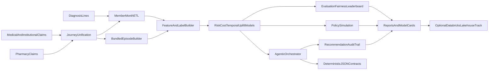

# Open Sourced Value Based Care ML Models

**VBC Intelligence OS** (distributed as `carevalue-claims-ml`) is an open-source, cloud-agnostic analytics and machine learning stack for organizations that operate under value-based payment, bundled episodes, and population health contracts. It is built for clinically interpretable signals derived from **longitudinal medical, institutional, and pharmacy claims**, unified into a coherent **patient journey** view for risk, cost, utilization pattern detection, and governance-ready model artifacts.

The platform targets payer actuarial and VBC operations teams, health system analytics, and care-management programs that require member-month feature stores, multi-model prediction (risk, cost, temporal behavior, uplift proxies), **episode-level financial and clinical-density scoring**, policy simulation, and agentic recommendation orchestration with audit trails.

## Healthcare claims ontology and glossary

- **Eligibility month**: covered member period used as denominator for PMPM analytics.
- **Claim header**: bundled treatment packages claim envelope including claim type, servicing provider, and aggregate allowed amount.
- **Claim line**: service-level granularity (CPT/HCPCS, revenue code, POS) used for utilization signatures.
- **ICD-10 diagnosis**: coded condition context used for morbidity proxies.
- **PMPM**: per member per month spend benchmark.
- **Attribution**: assignment of member responsibility to clinician group.
- **Risk stratification**: prospective identification of high-cost/high-need cohorts.
- **Care gap intervention**: operational outreach action (navigation, pharmacy follow-up, digital nudge).
- **Episode of care / bundled episode**: a time-bounded cluster of services (often anchored on an anchor procedure or admission) used for **episode-based payment** (e.g., BPCI, commercial bundles, specialty surgical episodes).
- **CPT / HCPCS**: procedure and supply codes on professional and outpatient claims; used for **procedural intensity** and bundle eligibility.
- **NDC**: National Drug Code on **pharmacy claims**; distinct NDC counts support **polypharmacy** and **medication therapy complexity** proxies.
- **Place of service (POS)**: setting of care on claim lines; supports site-of-care and **avoidable acute** utilization patterning when combined with diagnosis context.
- **Revenue codes**: institutional claim-line revenue centers; useful for **inpatient vs ancillary** intensity within an admission episode.
- **HCC-adjacent signals**: ICD-10-driven **comorbidity breadth** is a structural input to risk-adjustment-style analytics (this repository does not compute CMS-HCC coefficients; it exposes **condition count and trajectory** features for modeling).
- **Care fragmentation**: patterns of many small encounters or cross-modality spikes; member-month velocity features help ML detect **acceleration** in utilization.

## Integrated patient journey, patterns, and predictive signals

The ML pipeline is designed to **discover patterns** across modalities and time:

- **Claims + diagnosis + pharmacy**: merge professional/institutional lines with pharmacy fills (`journey merge`, `merge_medical_and_pharmacy_claims`) so models see **one longitudinal timeline** per member.
- **Utilization velocity**: member-month claim volume and allowed spend (`journey monthly-features`, `monthly_utilization_features`) surface **trend breaks**, seasonality, and post-acute ramps.
- **Pharmacy signals**: distinct NDC counts per member (`distinct_ndc_count_by_member`) support **polypharmacy risk** and MTM-style prioritization features.
- **Clinical and procedural density**: distinct ICD-10 and CPT/HCPCS counts (`diagnosis_morbidity_breadth_by_member`, `procedure_intensity_by_member`) enrich **episode scoring** and risk models.
- **Bundled episodes**: gap-based episode construction and scoring (`episodes build` / `score`) produce **episode allowed**, span, **financial intensity**, optional **ICD/CPT breadth**, and **within-cohort severity percentiles** for contract and CMMI-style analytics.

These features feed the existing **model suite** (risk, cost, temporal, uplift, anomaly, ranking) so teams can predict **high-cost probability**, **expected spend bands**, **behavior shifts**, and **intervention ROI proxies** while preserving subgroup fairness and model-card documentation.

## End-to-end architecture



## Data model and synthetic benchmark generation

### Core data assets

- `data/sample/claims_header.csv`
- `data/sample/claims_line.csv`
- `data/sample/diagnosis.csv`
- `data/sample/eligibility.csv`
- `data/sample/member_context.csv`
- `data/sample/interventions.csv`

### Synthetic design assumptions

- High-risk cohorts are injected with heavier claim intensity and cost burden.
- Temporal drift is introduced into benchmark trend factors for realistic backtesting stress.
- SDoH and dual-status proxy features provide equity/fairness analysis surfaces.
- Intervention propensity and engagement response fields support uplift and policy simulation.

Synthetic data is for benchmarking and reproducibility, not epidemiologic prevalence estimation.

## Feature and label specification

- **Feature windows**: rolling utilization and spend signatures over trailing months.
- **Lag features**: prior month allowed amount and utilization indicators.
- **Label horizon**: future allowed sum over configured months.
- **High-cost label**: quantile-based thresholding on future allowed sum for risk stratification.
- **Leakage controls**: temporal split semantics in temporal model variants and rolling feature construction.

## Model portfolio

### Risk intelligence
- Baseline calibrated high-cost risk model.
- Advanced stacked risk ensemble with uncertainty-aware triage scoring.
- Temporal risk model with time-series cross-validation.
- Risk trajectory segmentation model for cohort planning.
- Fairness-aware risk calibration variant for protected-population review.

### Cost intelligence
- Baseline cost regression.
- Quantile interval model (q10, q50, q90) for uncertainty-aware forecasting.
- Anomaly-based cost spike detector for outlier surveillance.
- Contract-sensitive ranking model for payer intervention sequencing.

### Intervention intelligence
- Uplift proxy model for outreach prioritization.
- Stronger uplift variant for treatment-response stratification.
- Contract impact projection including expected PMPM delta and shared-savings proxy.

### Policy intelligence
- Budget-constrained policy simulation for outreach allocation.
- Safety envelope with abstain and max outreach logic.
- Insurance contract scenario simulation (`optimistic`, `base`, `stress`).
- Policy constraint enforcement for shared-savings, downside caps, and risk corridor behavior.

## Real-World Insurance Use Cases

These examples show how payer analytics and value-based care operations teams can apply the current stack in real workflows.

### 1) Prospective high-cost member stratification for case management
- **Business problem**: Identify members likely to become high-cost in the next horizon before avoidable spend accelerates.
- **How this repo supports it**: High-cost risk models plus temporal validation (`models train-suite` and risk outputs).
- **Operational output**: Ranked member risk scores and model leaderboard artifacts.
- **Expected KPI impact**: Better risk capture precision, lower avoidable PMPM growth, improved care manager targeting yield.

### 2) Outreach queue optimization under fixed nurse capacity
- **Business problem**: Care teams cannot contact every flagged member each month.
- **How this repo supports it**: Policy simulation and recommendation guardrails (`policy simulate`, agent max outreach logic).
- **Operational output**: Capacity-constrained intervention list with abstain paths for overflow.
- **Expected KPI impact**: Higher interventions per FTE and stronger budget adherence.

### 3) Intervention prioritization using uplift-style targeting
- **Business problem**: Not all high-risk members respond equally to outreach.
- **How this repo supports it**: Uplift proxy model and `careGapAgent` eligibility gating.
- **Operational output**: Action-specific recommendations (`care_navigation_call`, `pharmacy_followup`, `digital_nudge`, abstain).
- **Expected KPI impact**: Higher intervention precision and improved ROI of care-management spend.

### 4) PMPM trend surveillance and contract early warning
- **Business problem**: Payers need early signal when PMPM trend drifts above target in shared-risk contracts.
- **How this repo supports it**: Benchmarks + summary reporting + contract impact agent outputs.
- **Operational output**: PMPM and trend outputs with expected contract delta projections.
- **Expected KPI impact**: Faster variance mitigation and improved forecastability of year-end performance.

### 5) Shared-savings and downside-risk forecasting
- **Business problem**: Finance and actuarial teams need scenario-level visibility into savings likelihood.
- **How this repo supports it**: Contract scoring, cost forecasts, and policy simulation outputs.
- **Operational output**: Expected PMPM delta and shared-savings impact proxies by recommended action cohort.
- **Expected KPI impact**: Better reserve planning and improved contracting strategy decisions.

### 6) Fairness-aware triage for vulnerable populations
- **Business problem**: Risk models can under-serve vulnerable groups without explicit equity checks.
- **How this repo supports it**: Subgroup fairness slicing and vulnerable-member protection rules in orchestration.
- **Operational output**: Slice-level evaluation plus adjusted recommendation behavior for protected cohorts.
- **Expected KPI impact**: Reduced fairness deltas and stronger compliance posture.

### 7) Data quality gating before model-driven operations
- **Business problem**: Bad upstream data can produce unstable intervention queues.
- **How this repo supports it**: `dataQualityAgent` drift/missingness/schema anomaly checks.
- **Operational output**: Quality alerts and auditable gate status before recommendations are consumed.
- **Expected KPI impact**: Fewer operational misfires caused by data defects.

### 8) Utilization management signal enrichment
- **Business problem**: UM teams need member-level risk context to prioritize outreach or review workflows.
- **How this repo supports it**: Risk + cost + temporal model stack and member-month feature lineage.
- **Operational output**: Structured risk and expected cost signals aligned to member-month records.
- **Expected KPI impact**: Earlier high-risk intervention opportunity and better alignment between UM and care management.

### 9) Pharmacy and chronic condition follow-up planning
- **Business problem**: Medication adherence and chronic burden patterns need proactive outreach stratification.
- **How this repo supports it**: Synthetic member context fields, intervention history, and `careGapAgent` action mapping.
- **Operational output**: Follow-up queues for pharmacy and care-navigation actions with rationale traces.
- **Expected KPI impact**: Better chronic population engagement and reduced acute utilization leakage.

### 10) Audit-ready recommendation governance for payer operations
- **Business problem**: Clinical operations and compliance teams need traceability for each recommendation.
- **How this repo supports it**: Deterministic JSON contracts, recommendation-only mode, and `why`/`why_not` audit logs.
- **Operational output**: Reproducible handoff artifacts and audit CSV outputs for governance review.
- **Expected KPI impact**: Improved model governance readiness and lower operational risk.

### 11) Contract-specific cohort strategy design
- **Business problem**: Different payer contracts require different intervention thresholds and action mixes.
- **How this repo supports it**: Configurable thresholds and scoring workflows with contract-aware reporting context.
- **Operational output**: Cohort-specific recommendation sets and benchmark comparisons per contract frame.
- **Expected KPI impact**: Better contract-level strategy fit and stronger medical cost containment.

### 12) Human-in-the-loop decision support for care operations
- **Business problem**: Teams need AI support without autonomous clinical action.
- **How this repo supports it**: Recommendation-only guardrails, abstain behavior, and optional deterministic LLM post-processing.
- **Operational output**: Decision-support recommendations for coordinator review, not autonomous execution.
- **Expected KPI impact**: Faster operational triage while preserving clinical governance controls.

### 13) Value-based care cost reduction optimizer
- **Business problem**: Prioritize members where interventions are most likely to reduce total cost of care under contract constraints.
- **How this repo supports it**: `vbc_cost_optimizer` family and contract policy enforcement/scenario simulation.
- **Operational output**: `reports/recommendations_policy_enforced.csv`, `reports/policy_scenarios.json`.
- **Expected KPI impact**: Higher cost containment efficiency and improved shared-savings potential.

### 14) Outcome improvement optimizer
- **Business problem**: Improve outcomes while balancing cost by targeting members with greatest expected intervention benefit.
- **How this repo supports it**: `outcome_improvement_optimizer` and blended cost-outcome policy metrics.
- **Operational output**: recommendation set with outcome deltas and scenario-level tradeoff scores.
- **Expected KPI impact**: Better quality proxy performance without uncontrolled spend growth.

### 15) Claims behavior prediction from longitudinal claims
- **Business problem**: Detect utilization behavior shifts early (e.g., rising avoidable ED/IP patterns).
- **How this repo supports it**: `claims_behavior_predictor` and temporal claims behavior features.
- **Operational output**: behavior-sensitive risk scores and trend-aware ranking outputs.
- **Expected KPI impact**: Earlier interventions and reduced avoidable utilization.

### 16) Provider advisory action model
- **Business problem**: Translate member predictions into actionable provider guidance.
- **How this repo supports it**: `provider_advisory_ranker` plus provider advisory fields in agentic outputs.
- **Operational output**: provider advisory action + rationale fields in recommendation and audit outputs.
- **Expected KPI impact**: Improved provider engagement and measurable actionability of predictive analytics.

### Use Case to Artifact Map

- High-cost stratification -> `reports/leaderboard.csv`, model artifact metadata JSON
- Outreach prioritization -> `reports/agent_recommendations.csv`
- Audit and compliance review -> `reports/agent_audit.csv`, `reports/agent_handoff_contract.json`
- Policy scenario planning -> `reports/policy_scenarios.json`
- Contract-constrained recommendation output -> `reports/recommendations_policy_enforced.csv`
- Cost reduction optimizer -> `models/*vbc_cost_optimizer*`, `reports/policy_scenarios.json`
- Outcome improvement optimizer -> `models/*outcome_improvement_optimizer*`, `reports/agent_recommendations.csv`
- Claims behavior predictor -> `models/*claims_behavior_predictor*`, `reports/leaderboard.csv`
- Provider advisory actions -> `reports/agent_recommendations.csv`, `reports/agent_audit.csv`

## Agentic decision orchestration

### Specialized healthcare agents

- `riskTriageAgent`: risk + uncertainty + fairness-aware triage priority.
- `careGapAgent`: intervention recommendation with uplift and eligibility gates.
- `contractImpactAgent`: PMPM and shared-savings impact projection.
- `dataQualityAgent`: drift, missingness, and schema anomaly checks.

### Stage narrative (operational flow)

1. `dataQualityAgent` checks schema and missingness before decisions.
2. `riskTriageAgent` creates risk-priority cohorts with uncertainty weighting.
3. `careGapAgent` proposes intervention classes with eligibility and uplift constraints.
4. `contractImpactAgent` estimates PMPM and shared-savings deltas.
5. Guardrails enforce recommendation-only behavior and abstain paths.
6. Deterministic contracts and audit traces are emitted for governance review.

### Safety guardrails

- Recommendation-only mode enabled by default.
- No autonomous clinical action pathways.
- Low-confidence abstain behavior.
- Outreach cap enforcement.
- Vulnerable member protection rules.

### Memory, contracts, and auditability

- Shared context store for quality metrics and guardrail state.
- Deterministic JSON handoff contracts between orchestration stages.
- Audit logs with `why` and `why_not` rationale fields per recommendation.

## Evaluation and governance

- Ranking metrics: ROC-AUC, average precision.
- Cost proxy metrics: MAE-aligned utility checks.
- Fairness slices: age bands, sex proxy, dual-status proxy.
- Artifact outputs:
  - leaderboard CSV
  - model card JSON
  - agent audit CSV
  - policy simulation JSON

## CLI command matrix

```bash
# Core data and feature workflows
carevalue-ml db init
carevalue-ml data generate --output data/generated
carevalue-ml data load --input-dir data/generated
carevalue-ml features build

# Modeling workflows
carevalue-ml models train
carevalue-ml models train-suite --suite maximal
carevalue-ml models train-use-cases
carevalue-ml models evaluate reports/predictions.csv
carevalue-ml models leaderboard reports/predictions.csv --model-name risk_v2 --run-id run_2026

# Policy and agentic workflows
carevalue-ml policy simulate reports/predictions.csv --budget 100
carevalue-ml policy scenario reports/agent_recommendations.csv
carevalue-ml policy enforce reports/agent_recommendations.csv --outreach-budget 100
carevalue-ml agents run reports/predictions.csv --output-path reports/agent_recommendations.csv
carevalue-ml agents validate-contract reports/agent_handoff_contract.json
carevalue-ml agents evaluate reports/agent_recommendations.csv reports/agent_recommendations_baseline.csv --budget 100

# Patient journey and episode analytics (unify medical + optional pharmacy, then engineer features)
carevalue-ml journey merge data/sample/claims_header.csv reports/journey_unified.csv
# With pharmacy file: add --pharmacy-path your_rx_claims.csv (same member_id, service_date, allowed_amount columns)
carevalue-ml journey monthly-features reports/journey_unified.csv
carevalue-ml episodes build reports/journey_unified.csv --archetype orthopedic --output-path reports/episodes.csv
carevalue-ml episodes score reports/episodes.csv --diagnosis-code-col diagnosis_code --procedure-code-col procedure_code
```

### Example insurer workflows

```bash
# Flow A: Risk + cost intelligence for actuarial review
carevalue-ml models train-suite --suite maximal
carevalue-ml models leaderboard reports/predictions.csv --model-name actuarial_suite --run-id r2026q1

# Flow B: Capacity-constrained care operations
carevalue-ml agents run reports/predictions.csv --run-id r2026q1 --contract-id DEMO
carevalue-ml policy enforce reports/agent_recommendations.csv --outreach-budget 120

# Flow C: Contract scenario planning
carevalue-ml policy scenario reports/agent_recommendations.csv
carevalue-ml agents evaluate reports/agent_recommendations.csv reports/agent_recommendations_baseline.csv --budget 120

# Flow D: Cost reduction + outcome improvement use-case pack
carevalue-ml models train-use-cases
carevalue-ml policy enforce reports/agent_recommendations.csv --outreach-budget 120
carevalue-ml policy scenario reports/agent_recommendations.csv
```

## Databricks-optional deployment track

The runtime remains vendor-neutral. Optional templates in `config/databricks` provide:

- bronze/silver/gold lakehouse mapping
- MLflow-compatible run tagging strategy
- agent-run lineage conventions and scalable simulation guidance

## Reproducibility and open-source operations

- Deterministic synthetic generation via seeded configs.
- Model artifacts include metadata sidecars with run ID, task, cohort, and feature hash.
- CI includes lint and test validation.
- Contribution and governance docs:
  - `CONTRIBUTING.md`
  - `MODEL_CARDS.md`
  - `ROADMAP.md`
  - `SECURITY.md`

## Clinical safety and scope boundary

- This repository supports analytics and decision support research workflows.
- It does not deliver autonomous clinical diagnosis or treatment.
- Keep human-in-the-loop review before operational intervention workflows.
- Use synthetic or de-identified data only in development/test contexts.

## License

MIT

## Multi-PyPI Expansion (Additive Roadmap)

This repository can publish multiple focused Python libraries while keeping the same codebase and preserving backward compatibility.

### 1) `carevalue-core-ml`
- **What it does**: trains and scores risk, cost, temporal, and uplift models on member-month features.
- **Who uses it**: payer/provider data science teams and analytics engineering teams.
- **Why it helps adoption**: creates a clean entry point for organizations that only need core ML without policy or agent complexity.

### 2) `carevalue-episodes`
- **What it does**: builds bundled episodes from claims and predicts episode-level cost, quality risk, and variance.
- **Who uses it**: bundled-payment programs, contracting teams, actuarial analysts.
- **Why it helps adoption**: supports one of the fastest-growing VBC payment motions with episode-native ML workflows.

### 3) `carevalue-policy-sim`
- **What it does**: simulates shared-savings, downside-risk, and bundled-payment outcomes from model outputs.
- **Who uses it**: finance strategy teams, value transformation leaders, contracting operations.
- **Why it helps adoption**: translates model scores into contract-ready decisions and financial planning scenarios.

### 4) `carevalue-benchmarks`
- **What it does**: ships national benchmark packs with synthetic population archetypes and standardized KPI reports.
- **Who uses it**: public-sector pilots, researchers, implementation partners, health plans evaluating tools.
- **Why it helps adoption**: enables apples-to-apples evaluation and easier procurement/comparison conversations.

### 5) `carevalue-agentic-care`
- **What it does**: orchestrates explainable triage and intervention recommendations with governance guardrails and audit logs.
- **Who uses it**: care management operations and platform engineering teams.
- **Why it helps adoption**: provides implementation-ready, human-in-the-loop operational pathways.


## How People Will Use These Libraries

### Typical workflow
1. Install `carevalue-core-ml` and train baseline/advanced models.
2. Add `carevalue-episodes` for bundled episode construction and forecasting.
3. Add `carevalue-policy-sim` to run budget and contract scenarios.
4. Add `carevalue-benchmarks` to compare against national synthetic archetypes.
5. Add `carevalue-agentic-care` for operational triage recommendations and auditable handoffs.

### Minimal install examples
```bash
pip install carevalue-core-ml
pip install carevalue-episodes
pip install carevalue-policy-sim
pip install carevalue-benchmarks
pip install carevalue-agentic-care
```

### Example usage shape (target API direction)
```python
from carevalue_core_ml import train_suite, score_population
from carevalue_episodes import build_episodes, score_episodes
from carevalue_policy_sim import run_contract_scenarios

models = train_suite(claims_df, eligibility_df, suite="maximal")
member_scores = score_population(models, member_month_df)
episodes = build_episodes(claims_df, archetype="orthopedic")
episode_scores = score_episodes(episodes)
scenario_report = run_contract_scenarios(member_scores, episode_scores, profile="bundled_base")
```

## First MVP Packaging Sequence

To move toward publication safely and additively:

1. Extend `pyproject.toml` metadata and extras for package boundaries.
2. Stabilize public exports in `src/carevalue_claims_ml/__init__.py`.
3. Add grouped CLI commands in `src/carevalue_claims_ml/cli.py` for core/episodes/policy/benchmarks/agents.
4. Publish multi-package usage docs in this `README.md`.
5. Add release-grade checks in `.github/workflows/ci.yml` for build, wheel validation, and smoke tests.

## VBC Intelligence OS Namespace (Implemented Scaffold)

The repository now includes a branded umbrella with additive sublibrary namespaces while preserving existing imports and CLI behavior.

### Umbrella
- **VBC Intelligence OS**

### Sublibrary import namespaces
- `vbc_intel_core`
- `vbc_intel_episodes`
- `vbc_intel_policy`
- `vbc_intel_benchmarks`
- `vbc_intel_careops`

### Quick import examples
```python
from vbc_intel_core import (
    merge_medical_and_pharmacy_claims,
    monthly_utilization_features,
    train_model_suite,
)
from vbc_intel_episodes import EPISODE_ARCHETYPES, build_bundled_episodes, score_episode_risk
from vbc_intel_policy import run_policy_scenarios, simulate_policy
from vbc_intel_benchmarks import calculate_pmpm
from vbc_intel_careops import run_agentic_pipeline
```

### CLI discovery
```bash
carevalue-ml libraries
carevalue-ml episodes --help
carevalue-ml journey --help
carevalue-ml benchmarks --help
carevalue-ml careops --help
```

## Publish to PyPI

Step-by-step instructions (Trusted Publishing, manual `twine`, versioning): see [`PUBLISHING.md`](PUBLISHING.md).

After release: `pip install carevalue-claims-ml`
