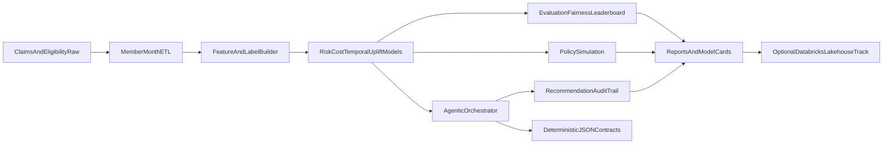

# Open Sourced Value Based Care ML Models

`Open Sourced Value Based Care ML Models` is an open-source, cloud-agnostic healthtech intelligence stack for value-based care (VBC) organizations that need clinically interpretable, contract-aware, and governance-ready machine learning over longitudinal claims data.

The platform is designed for payer and provider analytics teams operating PMPM and shared-savings contracts, with extensible workflows for member-month feature stores, multi-model risk and cost prediction, intervention prioritization, policy simulation, and agentic recommendation orchestration.

## Why this platform is differentiated

- **Contract-native analytics**: member-level predictions are linked to PMPM and shared-savings impact framing.
- **Modern model portfolio**: calibrated risk, interval cost forecasting, temporal validation, uplift proxy, and policy simulation.
- **Agentic orchestration**: specialized healthcare agents with recommendation-only guardrails, deterministic handoff contracts, and audit trails.
- **Cloud-agnostic by design**: local-first execution with optional Databricks-compatible templates for lakehouse and MLflow operations.
- **Governance-first artifacts**: model metadata sidecars, leaderboard generation, subgroup fairness slicing, and security boundaries.

## Healthcare claims ontology and glossary

- **Eligibility month**: covered member period used as denominator for PMPM analytics.
- **Claim header**: bundled treatment packages claim envelope including claim type, servicing provider, and aggregate allowed amount.
- **Claim line**: service-level granularity (CPT/HCPCS, revenue code, POS) used for utilization signatures.
- **ICD-10 diagnosis**: coded condition context used for morbidity proxies.
- **PMPM**: per member per month spend benchmark.
- **Attribution**: assignment of member responsibility to clinician group.
- **Risk stratification**: prospective identification of high-cost/high-need cohorts.
- **Care gap intervention**: operational outreach action (navigation, pharmacy follow-up, digital nudge).

## End-to-end architecture



## Data model and synthetic benchmark generation

### Core data assets

- `data/sample/claims_header.csv`
- `data/sample/claims_line.csv`
- `data/sample/diagnosis.csv`
- `data/sample/eligibility.csv`
- `data/sample/member_context.csv`
- `data/sample/interventions.csv`

### Synthetic design assumptions

- High-risk cohorts are injected with heavier claim intensity and cost burden.
- Temporal drift is introduced into benchmark trend factors for realistic backtesting stress.
- SDoH and dual-status proxy features provide equity/fairness analysis surfaces.
- Intervention propensity and engagement response fields support uplift and policy simulation.

Synthetic data is for benchmarking and reproducibility, not epidemiologic prevalence estimation.

## Feature and label specification

- **Feature windows**: rolling utilization and spend signatures over trailing months.
- **Lag features**: prior month allowed amount and utilization indicators.
- **Label horizon**: future allowed sum over configured months.
- **High-cost label**: quantile-based thresholding on future allowed sum for risk stratification.
- **Leakage controls**: temporal split semantics in temporal model variants and rolling feature construction.

## Model portfolio

### Risk intelligence
- Baseline calibrated high-cost risk model.
- Advanced stacked risk ensemble with uncertainty-aware triage scoring.
- Temporal risk model with time-series cross-validation.

### Cost intelligence
- Baseline cost regression.
- Quantile interval model (q10, q50, q90) for uncertainty-aware forecasting.

### Intervention intelligence
- Uplift proxy model for outreach prioritization.
- Contract impact projection including expected PMPM delta and shared-savings proxy.

### Policy intelligence
- Budget-constrained policy simulation for outreach allocation.
- Safety envelope with abstain and max outreach logic.

## Agentic decision orchestration

### Specialized healthcare agents

- `riskTriageAgent`: risk + uncertainty + fairness-aware triage priority.
- `careGapAgent`: intervention recommendation with uplift and eligibility gates.
- `contractImpactAgent`: PMPM and shared-savings impact projection.
- `dataQualityAgent`: drift, missingness, and schema anomaly checks.

### Safety guardrails

- Recommendation-only mode enabled by default.
- No autonomous clinical action pathways.
- Low-confidence abstain behavior.
- Outreach cap enforcement.
- Vulnerable member protection rules.

### Memory, contracts, and auditability

- Shared context store for quality metrics and guardrail state.
- Deterministic JSON handoff contracts between orchestration stages.
- Audit logs with `why` and `why_not` rationale fields per recommendation.

## Evaluation and governance

- Ranking metrics: ROC-AUC, average precision.
- Cost proxy metrics: MAE-aligned utility checks.
- Fairness slices: age bands, sex proxy, dual-status proxy.
- Artifact outputs:
  - leaderboard CSV
  - model card JSON
  - agent audit CSV
  - policy simulation JSON

## CLI command matrix

```bash
# Core data and feature workflows
carevalue-ml db init
carevalue-ml data generate --output data/generated
carevalue-ml data load --input-dir data/generated
carevalue-ml features build

# Modeling workflows
carevalue-ml models train
carevalue-ml models train-suite --suite maximal
carevalue-ml models evaluate reports/predictions.csv
carevalue-ml models leaderboard reports/predictions.csv --model-name risk_v2 --run-id run_2026

# Policy and agentic workflows
carevalue-ml policy simulate reports/predictions.csv --budget 100
carevalue-ml agents run reports/predictions.csv --output-path reports/agent_recommendations.csv
carevalue-ml agents validate-contract reports/agent_handoff_contract.json
carevalue-ml agents evaluate reports/agent_recommendations.csv reports/agent_recommendations_baseline.csv --budget 100
```

## Databricks-optional deployment track

The runtime remains vendor-neutral. Optional templates in `config/databricks` provide:

- bronze/silver/gold lakehouse mapping
- MLflow-compatible run tagging strategy
- agent-run lineage conventions and scalable simulation guidance

## Reproducibility and open-source operations

- Deterministic synthetic generation via seeded configs.
- Model artifacts include metadata sidecars with run ID, task, cohort, and feature hash.
- CI includes lint and test validation.
- Contribution and governance docs:
  - `CONTRIBUTING.md`
  - `MODEL_CARDS.md`
  - `ROADMAP.md`
  - `SECURITY.md`

## Clinical safety and scope boundary

- This repository supports analytics and decision support research workflows.
- It does not deliver autonomous clinical diagnosis or treatment.
- Keep human-in-the-loop review before operational intervention workflows.
- Use synthetic or de-identified data only in development/test contexts.

## License

MIT
